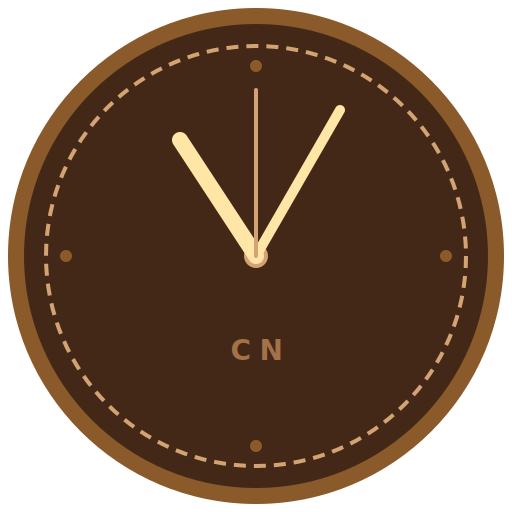

<div align="center">



<br>

# C A F E &nbsp; N E U R O T I C O &nbsp; C L O C K

**A floating desktop clock for the obsessively caffeinated.**

*Reads your game library. Wears your colors. Runs as many times as you want.*

<br>

[](LICENSE)
[](https://github.com/shampoo-is-a-lie)
[](https://electronjs.org)
[](https://github.com/shampoo-is-a-lie)

</div>

<br>

---

<br>

## ◈ &nbsp; What It Is

A lightweight, frameless clock widget that lives on your Linux desktop. It pulls game art directly from your **CNGM** and **EmuLatte** libraries to run as a Ken Burns slideshow backdrop, and it speaks the same visual language as the rest of the Cafe Neurotico ecosystem — 54 color palettes, warm typography, no decorations that weren't earned.

It's small enough to tuck into a corner. Beautiful enough to leave in the middle of your screen.

<br>

---

<br>

## ◈ &nbsp; Multiple Instances

> **Run as many clocks as you want, simultaneously.**

Launch the AppImage multiple times — each instance is independent. Give each one a different visual theme, a different color palette, a different size. Park one in a corner of your main monitor showing the time in **Minimalist** mode. Open another on your secondary screen in **Ken Burns** mode cycling through game art. Stack a third in CREMA Splash if you just want something large and atmospheric.

No configuration needed. Just launch it again.

```bash
./CafeNeuroticoClock.AppImage &
./CafeNeuroticoClock.AppImage &
./CafeNeuroticoClock.AppImage &
```

Each instance has its own settings window and saves nothing to a shared state that would affect the others.

<br>

---

<br>

## ◈ &nbsp; Visual Themes

Three distinct presentations — each resizable, each adapting to your chosen color palette:

<br>

```
┌─────────────────────────────────────────────────────────┐
│  MINIMALIST   Small floating widget. Dashed border.     │
│               Semi-transparent. Stays out of your way.  │
│               400 × 160  (default)                      │
├─────────────────────────────────────────────────────────┤
│  CREMA        Full-window dark splash. Central circle.  │
│  SPLASH       The CREMA boot aesthetic, as a clock.     │
│               700 × 700  (default)                      │
├─────────────────────────────────────────────────────────┤
│  KEN BURNS    Game art fills the window. Smooth         │
│               pan-and-zoom crossfades. Clock centered   │
│               over a dark gradient overlay.             │
│               900 × 560  (default)                      │
└─────────────────────────────────────────────────────────┘
```

All windows are **freely resizable** — the clock text scales proportionally with the window.

<br>

---

<br>

## ◈ &nbsp; Color Themes

**54 palettes** organized across 7 categories. Applied live — no restart.

| Category | Themes |
|:---|:---|
| **Originals & System** | DARK GRAY · CREMA · CYBERPUNK · SNOW · MOVIESFLIX · VAPOUR OS · PSIV BLUE · GREEN BOX · WIN XP |
| **Gaming Legends** | GAME BOY DMG · PIP BOY · SEVASTOPOL · RIP AND TEAR CLASSIC · SUPER BROTHERS · GREEN HILL · NES · SNES · BLOODBORNE · METROID PRIME · SILENT HILL · DIABLO · HALF-LIFE · SHOVEL KNIGHT |
| **Aesthetics** | EARTHY & ORGANIC · DOPAMINE BRIGHTS · RETRO REVIVAL · VAPORWAVE · AURORA · NOIR · BIOLUMINESCENCE · BRUTALIST |
| **Linux Ricing** | DRACULA · GRUVBOX · NORD · SOLARIZED DARK · CATPPUCCIN (3 flavors) · TOKYO NIGHT · EVERFOREST · ROSÉ PINE · OXOCARBON · MATERIAL DARK |
| **Sci-Fi Universes** | N7 · TRON LEGACY · DEAD SPACE · COLONY SHIP · NECROMORPH |
| **Horror Realm** | CRIMSON PEAK · LAKESIDE CURSE · THE BACKROOMS |
| **PSIII Colors** | CLASSIC · RED · GREEN · BLUE · PURPLE · GOLD · SILVER |

The color theme also affects the Minimalist widget background — each palette tints the transparency to match its own `bg` color.

<br>

---

<br>

## ◈ &nbsp; Art Slideshow

When the Ken Burns effect is enabled, the clock reads images from:

- `GameManagerConfig/images/` — CNGM game art (heroes, covers, screenshots)
- `GameManagerConfig/EmuLatte/images/` — EmuLatte art, organized by platform
- `GameManagerConfig/wallpapers/` — curated wallpapers (see below)

Images are classified by filename and directory. You can narrow the source to a single category — **Heroes**, **Covers**, **Screenshots**, or **Wallpapers** — or leave it on **All** for the full library.

Enable **Show Game Name** in settings to display a fading label with the game title when each image appears.

<br>

---

<br>

## ◈ &nbsp; Installation

### From a Release

```bash
# Download CafeNeuroticoClock.AppImage from the Releases page, then:
chmod +x CafeNeuroticoClock.AppImage
./CafeNeuroticoClock.AppImage
```

Place it alongside your CNGM installation (e.g. `~/Games/CNGM/`) so it can find the game art automatically.

<br>

### Wallpapers

Wallpapers are not bundled in the AppImage. To use them:

1. Download **`wallpapers.zip`** from the [Releases](../../releases) page
2. Extract the contents next to the AppImage:

```
~/Games/CNGM/
├── CafeNeuroticoClock.AppImage
└── GameManagerConfig/
    └── wallpapers/
        ├── 1.png
        ├── 2.png
        └── ...
```

Then open Settings → Image Source → **Wallpapers**.

> If no wallpapers are found, the settings window will tell you so with installation instructions.

<br>

### Building from Source

```bash
git clone https://github.com/shampoo-is-a-lie/CafeNeuroticoClock
cd CafeNeuroticoClock
npm install
npm start          # run in development
npm run dist       # build AppImage and deploy to ~/Games/CNGM/
```

The `postdist` script deploys the AppImage and wallpapers to `~/Games/CNGM/` automatically.

<br>

---

<br>

## ◈ &nbsp; Settings

Open with the **⚙** button (top-right of any clock window).

| Setting | Options | Description |
|:---|:---|:---|
| **Visual Theme** | Minimalist · CREMA Splash · Ken Burns | Changes window layout and size |
| **Art Slideshow** | Off · On | Enables the KB background on Minimalist and CREMA themes |
| **Image Source** | All · Heroes · Covers · Screenshots · Wallpapers | Filters which images appear |
| **Show Game Name** | Off · On | Displays a fading title label when each image loads |
| **Color Theme** | 54 palettes | Live preview — the settings window recolors itself too |

<br>

---

<br>

## ◈ &nbsp; The Cafe Neurotico Ecosystem

```
  CREMA          Boot splash and system branding
     │
     └──▸  CNGM           Game Manager — browse, launch, manage your library
               │
               ├──▸  GRINDER        ROM importer — GOG, Epic, custom games
               │
               ├──▸  EmuLatte       Emulation frontend — ROMs, cores, saves
               │
               └──▸  CN Clock       This. Floating time. Ambient art. ◈
```

CN Clock reads game art from wherever CNGM and EmuLatte store it — no extra setup if you're already in the ecosystem.

<br>

---

<br>

<div align="center">

*Built by* **Shampoo is a Lie** &nbsp;·&nbsp; GPL-3.0 &nbsp;·&nbsp; *Made for Linux desktops that take aesthetics seriously*

```
◈ ─────────────────────────────────────── ◈
```

</div>
